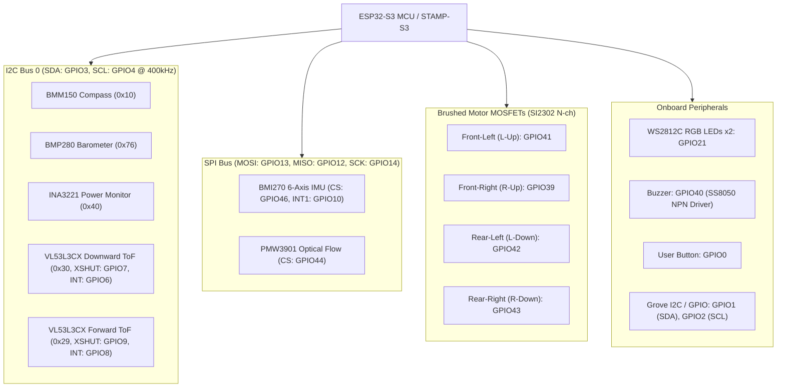

# M5StampFly Hardware & Sensor Technical Documentation

This document provides a comprehensive permanent record of the **M5StampFly** hardware schematics, pin mappings, and sensor datasheet specifications.

---

## 📁 Archived PDF Schematics & Datasheets

The original high-resolution schematics and full component datasheets are stored permanently in the repository:

### 📐 Hardware Schematics
- **StampFly Mainboard Schematic**: [StampFly_Mainboard_Schematic.pdf](file:///Volumes/work2/ardupilot-stampfly-dev/docs/hardware/schematics/StampFly_Mainboard_Schematic.pdf)
- **VL53L3CX Rangefinder Modular Board**: [VL53L3CX_ToF_Board_Schematic.pdf](file:///Volumes/work2/ardupilot-stampfly-dev/docs/hardware/schematics/VL53L3CX_ToF_Board_Schematic.pdf)
- **PMW3901 Optical Flow Modular Board**: [PMW3901_Optical_Flow_Board_Schematic.pdf](file:///Volumes/work2/ardupilot-stampfly-dev/docs/hardware/schematics/PMW3901_Optical_Flow_Board_Schematic.pdf)

### 📑 Sensor Datasheets
- **Bosch BMI270 6-Axis IMU (162 pages)**: [BMI270_Datasheet.pdf](file:///Volumes/work2/ardupilot-stampfly-dev/docs/hardware/datasheets/BMI270_Datasheet.pdf)
- **Bosch BMM150 3-Axis Geomagnetic Compass (56 pages)**: [BMM150_Datasheet.pdf](file:///Volumes/work2/ardupilot-stampfly-dev/docs/hardware/datasheets/BMM150_Datasheet.pdf)

---

## 1. System Overview & Architecture

M5StampFly is an ultra-compact indoor micro quadcopter powered by the **Espressif ESP32-S3** (M5Stack STAMP-S3 module).

---

## 2. Complete ESP32-S3 (STAMP-S3) Pinout & Mapping

| GPIO | Pin Label | Type | Connected Function / Peripheral | Circuit Description |
| :--- | :--- | :--- | :--- | :--- |
| **GPIO0** | `USER_A` / `Boot` | Input | User Push Button (S1) | Active LOW (pulled up) |
| **GPIO1** | `GROVE_SDA` | I/O | Grove Port Pin 1 / J2 (IO), J3 (I2C) | External expansion |
| **GPIO2** | `GROVE_SCL` | I/O | Grove Port Pin 2 / J2 (IO), J3 (I2C) | External expansion |
| **GPIO3** | `INT_SDA` | I/O | Main I2C0 SDA | 4.7kΩ pull-up to +3.3V |
| **GPIO4** | `INT_SCL` | Output | Main I2C0 SCL | 4.7kΩ pull-up to +3.3V |
| **GPIO6** | `INT_G1` | Input | Downward VL53L3CX Interrupt (INT_DOWN) | Internal ToF interrupt |
| **GPIO7** | `INT_XSHUT` | Output | Downward VL53L3CX Power/Reset (XSHUT_DOWN) | Active HIGH (0 = reset, 1 = run) |
| **GPIO8** | `EXT_G1` | Input | Forward VL53L3CX Interrupt (INT_FORWARD) | Front ToF interrupt via P3 |
| **GPIO9** | `EXT_XSHUT` | Output | Forward VL53L3CX Power/Reset (XSHUT_FORWARD) | Front ToF reset via P3 |
| **GPIO10** | `INT1` | Input | BMI270 IMU Interrupt 1 | High-speed motion data ready |
| **GPIO12** | `MISO` | Input | Main SPI MISO | Shared between BMI270 & PMW3901 |
| **GPIO13** | `MOSI` | Output | Main SPI MOSI | Shared between BMI270 & PMW3901 |
| **GPIO14** | `SCK` | Output | Main SPI Serial Clock | Shared between BMI270 & PMW3901 |
| **GPIO21** | `RGB` | Output | WS2812C Addressable RGB LEDs (LED1, LED2) | Single-wire data protocol |
| **GPIO39** | `R-Up` | Output | Front-Right Motor (Q3 SI2302 N-ch FET) | Brushed PWM output |
| **GPIO40** | `BEEP` | Output | Piezo Buzzer LS1 (Q2 SS8050 NPN Driver) | ToneAlarm audio |
| **GPIO41** | `L-Up` | Output | Front-Left Motor (Q4 SI2302 N-ch FET) | Brushed PWM output |
| **GPIO42** | `L-Down` | Output | Rear-Left Motor (Q5 SI2302 N-ch FET) | Brushed PWM output |
| **GPIO43** | `R-Down` | Output | Rear-Right Motor (Q6 SI2302 N-ch FET) | Brushed PWM output |
| **GPIO44** | `CS2` | Output | PMW3901 Optical Flow Chip Select | Active LOW via P4 |
| **GPIO46** | `CS` | Output | BMI270 IMU Chip Select | Active LOW |

---

## 3. I2C Bus Devices (I2C0: SDA=GPIO3, SCL=GPIO4 @ 400kHz)

All primary onboard sensors share the internal `I2C0` bus with 4.7kΩ pull-up resistors to `+3.3V`:

| Device | IC Part # | 7-bit Address | Address Configuration | Description |
| :--- | :--- | :---: | :--- | :--- |
| **Compass** | BMM150 | `0x10` | `CSB=GND`, `SDO=GND` | 3-axis geomagnetic sensor (Bosch) |
| **Power Monitor** | INA3221 | `0x40` | `A0=GND` | Triple-channel voltage/current monitor (TI) |
| **Barometer** | BMP280 | `0x76` | `CSB=3.3V`, `SDO=GND` | Digital pressure & altitude sensor (Bosch) |
| **ToF (Downward)** | VL53L3CX | `0x30` *(reallocated)* | Initial: `0x29`, readdressed dynamically via `GPIO7` | Floor distance & landing detection (ST) |
| **ToF (Forward)** | VL53L3CX | `0x29` *(default)* | Initial: `0x29`, kept after Downward ToF is readdressed | Forward obstacle distance (ST) |

---

## 4. SPI Bus Devices (MOSI=GPIO13, MISO=GPIO12, SCK=GPIO14)

| Device | IC Part # | Chip Select | Max Clock | Mode | Description |
| :--- | :--- | :---: | :---: | :---: | :--- |
| **IMU** | BMI270 | `GPIO46` (`CS`) | 10 MHz | Mode 0 / 3 (4-wire) | Primary 6-axis Gyro & Accelerometer |
| **Optical Flow** | PMW3901MB-TXQT | `GPIO44` (`CS2`) | 2 MHz | Mode 3 (4-wire) | Ground motion velocity sensor via P4 |

---

## 5. Sensor Technical Datasheet Details

### 5.1 Bosch BMI270 (6-Axis Low-Power IMU)
- **Features**: 16-bit digital triaxial accelerometer (±2g/±4g/±8g/±16g) + 16-bit triaxial gyroscope (±125 to ±2000 dps).
- **Supply Voltage**: VDD: 1.71V–3.6V, VDDIO: 1.2V–3.6V.
- **Chip ID**: `0x24` at register `0x00`.
- **Initialization Requirement**: Must upload 8 kB initialization microcode config burst to register `0x5E` (`INIT_DATA`) following power-on before high-performance mode is available.
- **Key Registers**:
  - `0x00` (`CHIP_ID`): Returns `0x24`.
  - `0x02` (`ERR_REG`): Fatal / FIFO error flags.
  - `0x0C`–`0x11` (`DATA_8`–`DATA_13`): `ACC_X`, `ACC_Y`, `ACC_Z` (16-bit two's complement).
  - `0x12`–`0x17` (`DATA_14`–`DATA_19`): `GYR_X`, `GYR_Y`, `GYR_Z` (16-bit two's complement).
  - `0x40` (`ACC_CONF`): ODR and bandwidth filter settings.
  - `0x42` (`GYR_CONF`): Gyro ODR and noise performance mode.
  - `0x7C` (`PWR_CONF`) / `0x7D` (`PWR_CTRL`): Power and sensor domain enable.
  - `0x7E` (`CMD`): Soft reset command `0xB6`.

### 5.2 Bosch BMM150 (3-Axis Geomagnetic Compass)
- **Features**: 3-axis magnetic field sensor based on FlipCore technology.
- **Supply Voltage**: VDD: 1.62V–3.6V, VDDIO: 1.2V–3.6V.
- **Magnetic Range**: ±1300 µT (X, Y axis), ±2500 µT (Z axis). Resolution ~0.3 µT.
- **Chip ID**: `0x32` at register `0x40` (accessible only after `0x4B` Power Control bit = 1).
- **Key Registers**:
  - `0x40` (`CHIP_ID`): Returns `0x32`.
  - `0x42`–`0x47`: `DATAX` (13-bit), `DATAY` (13-bit), `DATAZ` (15-bit).
  - `0x48`–`0x49`: `RHALL` (14-bit Hall resistance for temperature compensation).
  - `0x4B` (`POWER_CONTROL`): Bit 0: Power Control (1 = sleep/active, 0 = suspend), Bit 1/7: Soft reset.
  - `0x4C` (`OPMODE`): Output data rate (ODR 2Hz–30Hz) and operational mode (Normal: 00b, Forced: 01b, Sleep: 11b).
  - `0x51` (`REPXY`) / `0x52` (`REPZ`): Number of measurement repetitions for noise filtering.

### 5.3 STMicroelectronics VL53L3CX (Multi-Target ToF Distance Sensor)
- **Features**: Time-of-Flight ranging sensor with multi-target histogram detection up to 3000 mm.
- **Default I2C Address**: `0x29` (8-bit write `0x52`, read `0x53`).
- **Dynamic Address Reallocation**:
  - Downward sensor (`XSHUT: GPIO7`) is booted alone, initialized, and readdressed to `0x30` (`0x60` in 8-bit ST format).
  - Forward sensor (`XSHUT: GPIO9`) is subsequently released and operates at default `0x29`.
- **Target Selection**:
  - Selects the return target with highest `SignalRateRtnMegaCps` to reject dust/frame crosstalk.
  - Accepts statuses `0` (Valid), `1` (Sigma warning), `2` (Signal warning), `3` (Min range clipped), `4` (Out of bounds), `6`, `11`, `12`, `13`.

### 5.4 PixArt PMW3901MB-TXQT (Optical Flow Motion Sensor)
- **Features**: Low-power optical motion sensor for velocity tracking over textured ground.
- **Interface**: 4-wire SPI (Mode 3, up to 2 MHz clock).
- **Working Distance**: 80 mm to infinity.
- **Power**: 1.8V (Core) and 3.3V (I/O) supplied by onboard LDO regulators `U1` (TPAP7343D-18FS4) and `U2` (TPAP7343D-33FS4) from 5V line.

### 5.5 TI INA3221 (Triple-Channel Voltage & Current Monitor)
- **Features**: 3-channel, high-side current and bus voltage monitor with I2C interface.
- **I2C Address**: `0x40` (A0 = GND).
- **Current Shunt**: `R12` = 0.01 Ω (10 mΩ) sense resistor on Channel 1 (`IN1P` / `IN1N`) for total battery current monitoring.

---

## 6. External Connectors & Pinouts

### 6.1 Front Rangefinder Header (P3: A2005WR-2x4P)
Used for the modular forward-facing VL53L3CX breakout board:
- **Pin 1**: `INT_SCL` (I2C0 SCL / GPIO4)
- **Pin 2, 4**: `VBAT` (Battery Voltage)
- **Pin 3**: `INT_SDA` (I2C0 SDA / GPIO3)
- **Pin 5**: `EXT_G1` (GPIO8 / Forward ToF Interrupt)
- **Pin 6, 8**: `GND` (Ground)
- **Pin 7**: `EXT_XSHUT` (GPIO9 / Forward ToF Shutdown/Reset)

### 6.2 Optical Flow Header (P4: KH-A1001WF-06A)
Used for the modular PMW3901 optical flow breakout board:
- **Pin 1**: `GND`
- **Pin 2**: `+5VOUT`
- **Pin 3**: `MOSI` (GPIO13)
- **Pin 4**: `MISO` (GPIO12)
- **Pin 5**: `SCK` (GPIO14)
- **Pin 6**: `CS2` (GPIO44)

### 6.3 Grove Port (J2: IO / J3: I2C)
Standard Grove 4-pin 2.0mm pitch interface:
- **Pin 1**: `GROVE_SCL` / `GROVE_I` (GPIO2)
- **Pin 2**: `GROVE_SDA` / `GROVE_O` (GPIO1)
- **Pin 3**: `+5VOUT` / `VCC`
- **Pin 4**: `GND`

---

## 7. Power Supply Scheme

- **Battery Input**: 1S LiPo (3.7V nominal, 4.2V max) connected via J1 (2-pin 2.0mm connector).
- **Power Switching**: P-channel Power MOSFET `Q1` (HXY50P03DF / AP50P20Q) and Schottky Diode `D3` (B5819W).
- **+3.3V Rail**: Regulated onboard by low-dropout regulator `U2` (HT7533).
- **+5V Rail**: Boost converter providing power to Grove, Optical Flow, and Front sensor modules.
